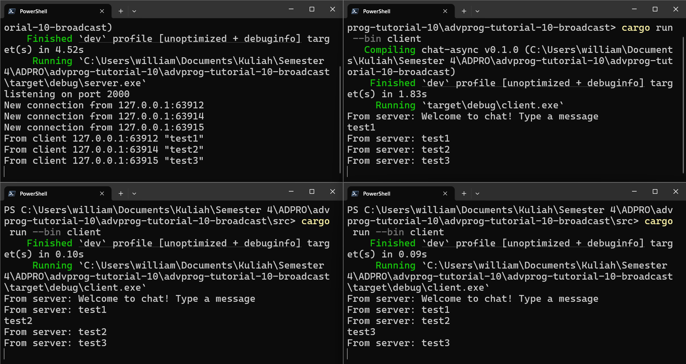
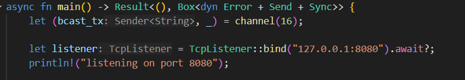
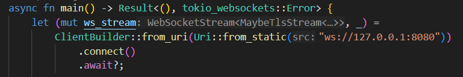

# advprog-tutorial-10

## Experiment 2.1: Original code, and how it run

The application can be run by going into the `src` direction and then running the `cargo run` command in the terminal. However, because the clients are dependent on the server, the client can only run if the server is already run. Therefore, it is only normal that we should run the server before running the client. Once the clients are up, we can send messages through the client which is then sent to and received by the server. The server, in turn, would broadcast the message to other clients that are connected to the server, thus allowing communication between clients.

## Experiment 2.2: Modifying Port
There are two parts of the code that we need to change, namely the one in `server.rs` and the one in `client.rs`
1. For the one in the server side of the code, the change is as follows:

From the image above, we change the listener to listen to port `8080` instead of `2000` as required by the experiment.

2. For the on in the client side of the code, the change is as follows:

Now, since the server is listening to port `8080`, we need to connect the client's WebSocket (`ws://` protocol) to port `8080` as well so that any messages sent would be sent to port `8080` instead of port `2000`.

